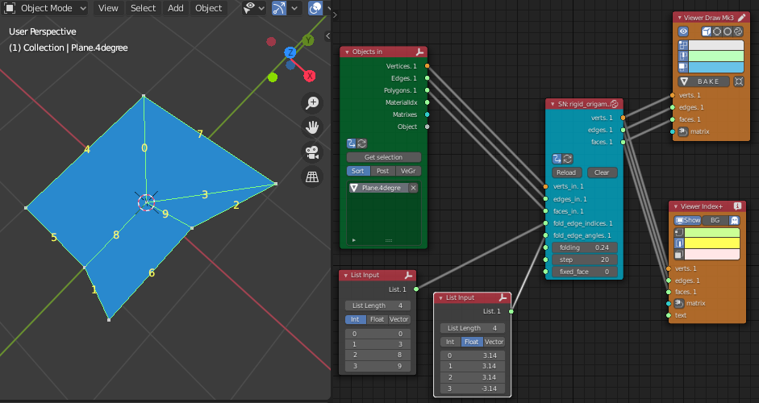

# Rigid Origami Folding in Blender with add-ons

## Description

This repository offers scripts to simulate rigid origami folding in Blender using sverchok and animation node add-ons.

Scripts in this repositody have been written with reference to:
https://origami.c.u-tokyo.ac.jp/~tachi/cg/SimulationOfRigidOrigami_tachi_4OSME.pdf

## Installation

### sverchok

* Download ./sverchok/rigid_origami_folding.py
* Open Blender and load the script in Blender's text editor
* Add SNLite script node in sverchok node tree
* Select rigid_origami_folding.py in SNLite script node

### animation nodes

(constructing)

## Usage

### sverchok

After loading script in SNLite script node, the nodes will show its parameters. Set the parameters with connecting nodes.

Parameters:

- obj_in:&emsp; paper object which has some edges inside
- valleys:&emsp; edge list for valley folding
- valley_angle:&emsp; angle (radian) of valley edges
- mountains:&emsp; edge list for mountain folding
- mountain_angle:&emsp; angle (radian) of mountain edges
- folding:&emsp; ratio of the folding angle (0 to 1)
- step:&emsp; delta rho angle step (for example,  pi * 0.005, pi * 0.01, pi * 1.0)
- fixed_face:&emsp; index number of fixed face

This image is an example of the node tree.

### animation nodes

(constructing)

## Requirements

* Blender 2.8 (or later)
* sverchok add-on 0.6 (or later)
* animation nodes add-on 2.1.7 (or later)

## Author

asahidari

## License

[GPL 3](https://www.gnu.org/licenses/quick-guide-gplv3.html)

