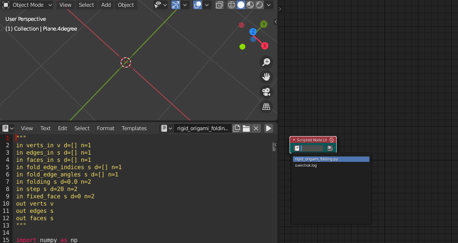

# Rigid Origami Folding in Blender with add-ons

## Description

This repository offers scripts to simulate rigid origami folding in Blender using sverchok and animation node add-ons.

Scripts in this repositody have been written with reference to:
https://origami.c.u-tokyo.ac.jp/~tachi/cg/SimulationOfRigidOrigami_tachi_4OSME.pdf

## Installation

### sverchok

This script node was already merged in sverchok's master as rigid origami full node (Aug. 20, 2020). You can use it without the following process if you will not use this as SNLite script node.
https://github.com/nortikin/sverchok/pull/3416

* Download ./sverchok/rigid_origami_folding.py
* Open Blender and load the script in Blender's text editor
* Add SNLite script node in sverchok node tree
* Select rigid_origami_folding.py in SNLite script node

### animation nodes

Rigid origami script for animation nodes add-on is also stored in this repository. You can load the script for animation nodes in animation-nodes editor like sverchok, so the rest details are skipped.

## Usage

### sverchok

After loading script in SNLite script node, the nodes will show its parameters. Set the parameters with connecting nodes.

Parameters:

- verts_in:&emsp; Vertices of a source paper object
- edges_in:&emsp; Edges of a source paper object
- faces_in:&emsp; Faces of a source paper object
- fold_edge_indices:&emsp; Edge indices to be folded
- fold_edge_angles:&emsp; Target edge angles for each edges to be folded
- folding:&emsp; ratio of the folding angle (0 to 1)
- step:&emsp; step count to calculate destination angles
- fixed_face:&emsp; index number of fixed face (to be kept stand still)

This image is an example of the node tree.

### animation nodes

The way to use the node is similar to the sverchok's node. So the details in animation nodes are skipped.

## Requirements

* Blender 2.8 (or later)
* sverchok add-on 0.6 (or later)
* animation nodes add-on 2.1.7 (or later)

## Author

asahidari

## License

[GPL 3](https://www.gnu.org/licenses/quick-guide-gplv3.html)

